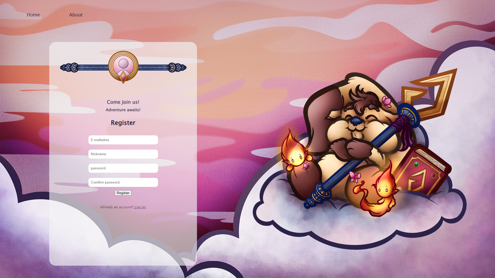
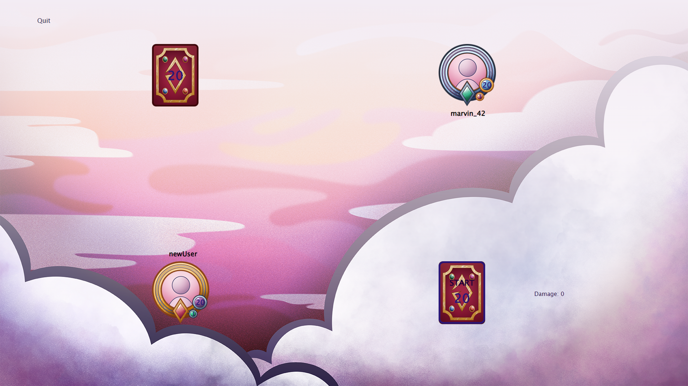
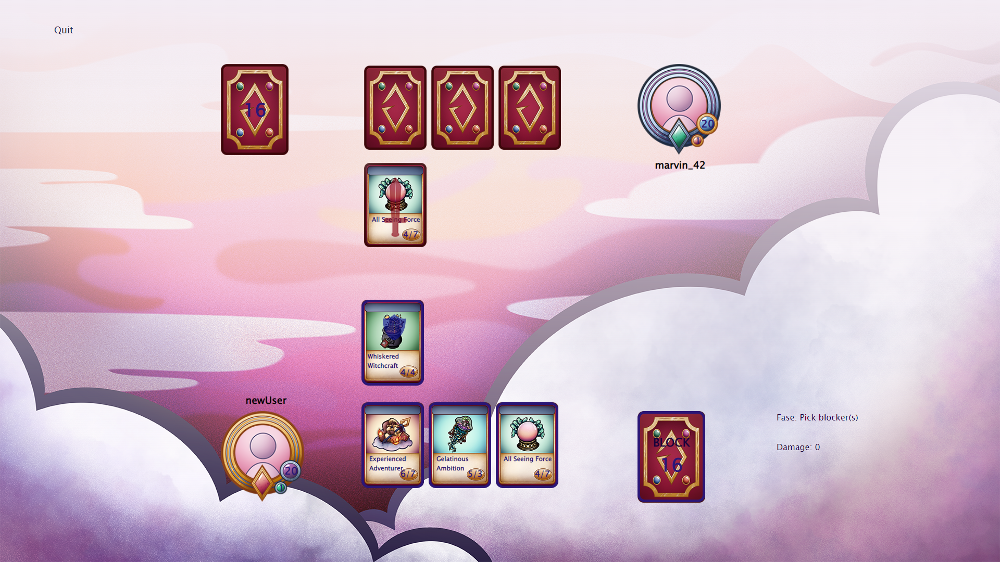
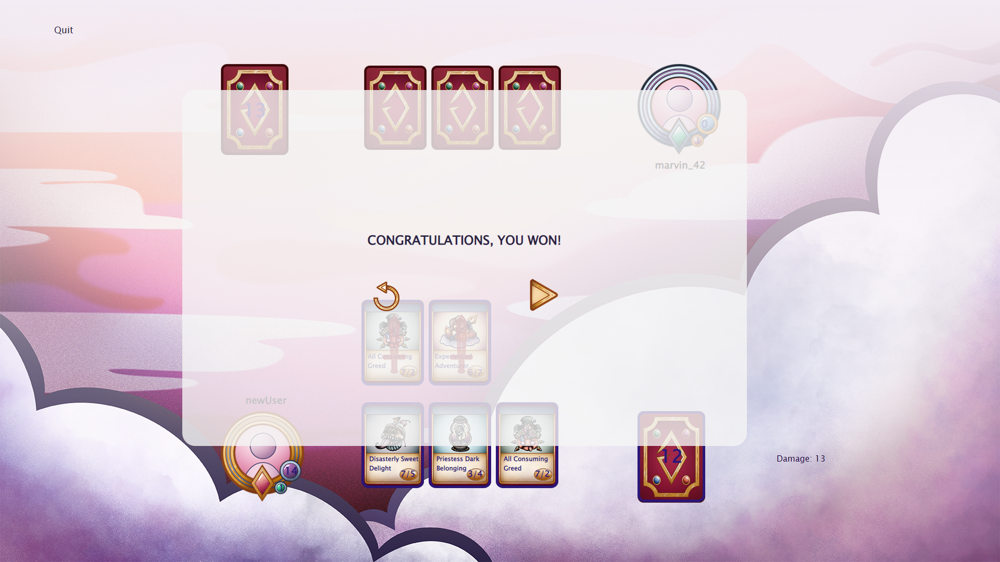
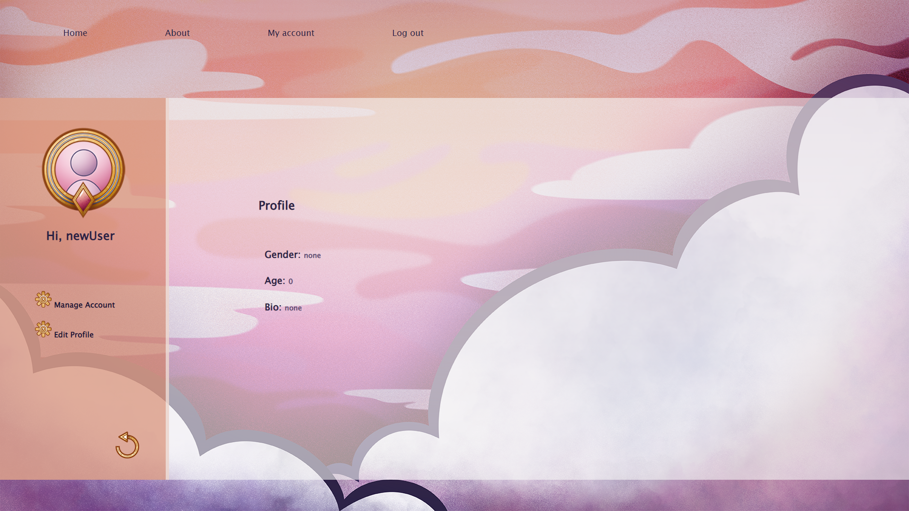
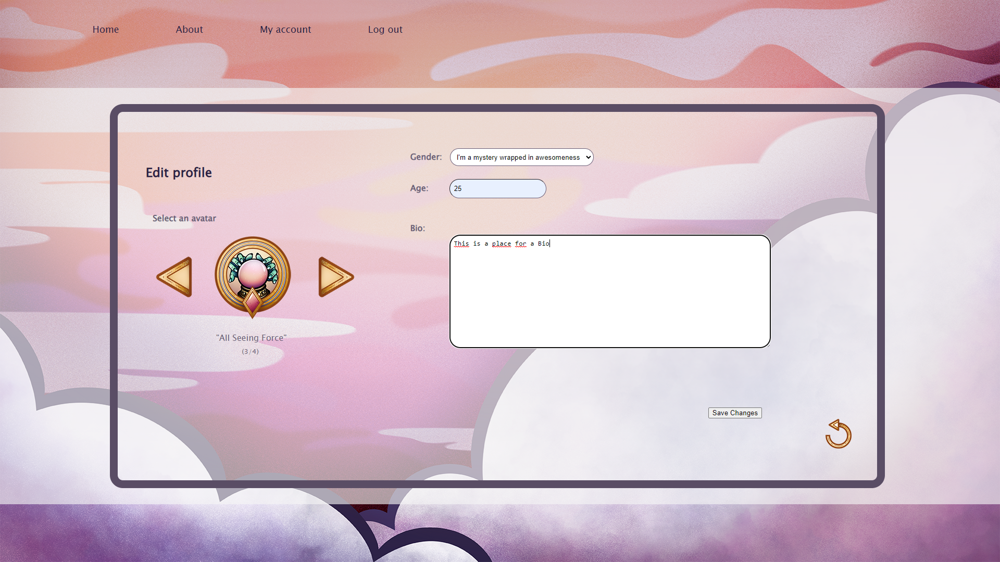
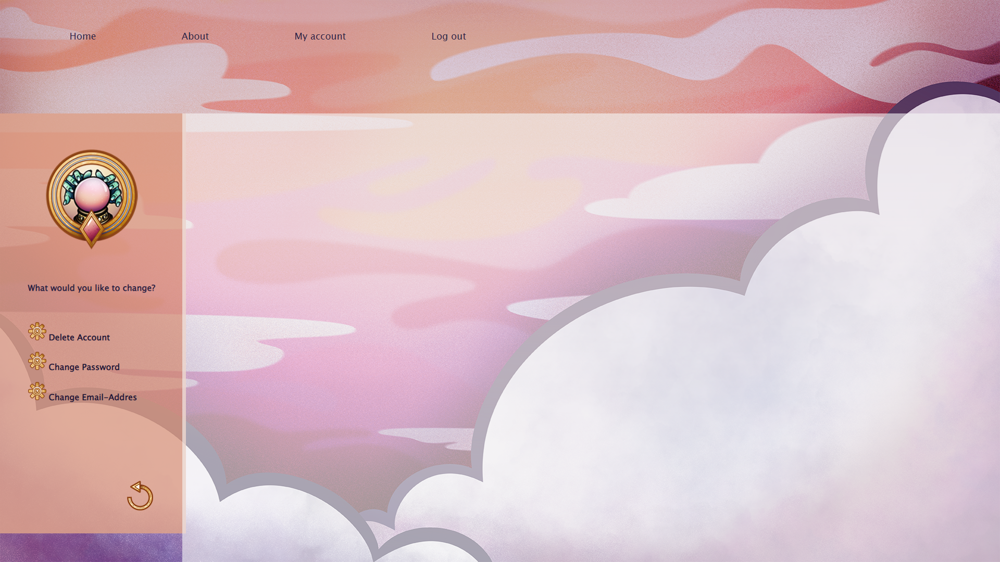

<h1 align="center" id="title">Spells Of Nimhdora</h1>

Base of a strategy cardgame. Layout created with own illustrations wich i made in procreate.

<h2>🧐 Features</h2>

Here're some of the project's best features:

*   Register
*   Login
*   The ability to edit a mini profilepage
*   The ability manage your account (change password, change e-mail, delete account)

  
  
<h2>💻 Built with</h2>

Technologies used in the project:

*   PHP
*   SQL
*   HTML5
*   CSS3

<h2>Project Screenshots:</h2>

